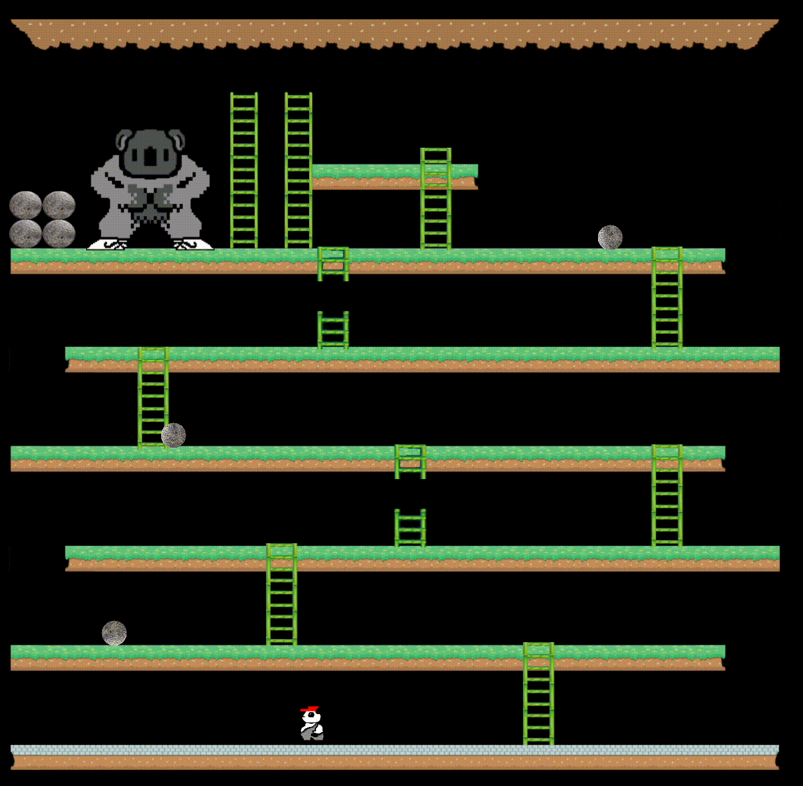
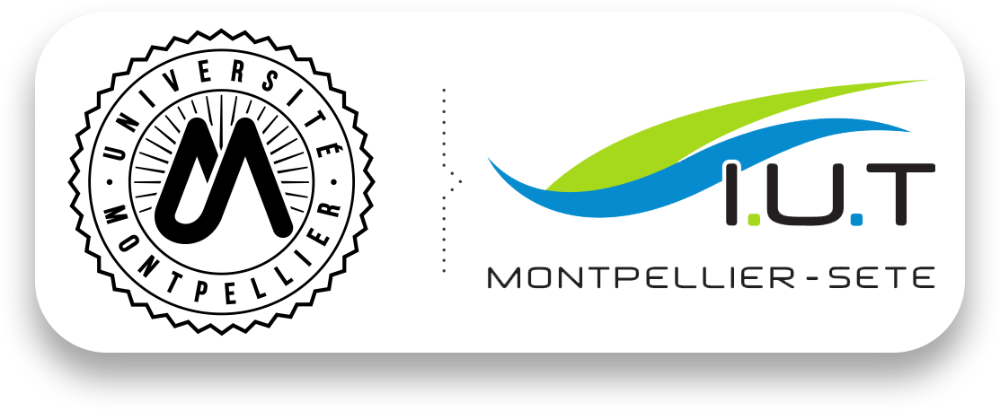

<h1 align="center">
  <br>
  </a>
  <br>
  Projet - Donkey Kong
  <br>
</h1>

<h4 align="center">Université de Montpellier-Séte</h4>

<p align="center">
  <a href="#le-projet">Le projet</a> •
  <a href="#comment-lutiliser">Comment l'utiliser</a> •
  <a href="#credits">Credits</a>
</p>

<div align="center">
</a>
</div>

## Le projet

Nous sommes une équipe de 5 étudiants en 2e année de BUT informatique à l'Université de Montpellier-Séte. Nous avons réalisé ce projet dans le cadre d'une SAE. Ce projet a pour but de nous faire découvrir le langage Java et de nous faire travailler en équipe.
## Comment l'utiliser

Pour mettre en route cette application vous aurez besoin d'exécuter les commandes suivante :
```bash
# Cloner ce dépôt
$ git clone https://github.com/DK-Project-IUT/DK-Project

# Allez dans ce dépôt
$ cd DK-Project
```

> **Note**
> : Vous pouvez utiliser directement votre IDE pour cloner ce  [dépot](https://github.com/DK-Project-IUT/DK-Project).


## Credits

<b>Product Owner</b> : Valentin Vanhove\
<b>Scrum Master</b> : Joris Rodrigues\
<b>Dev Team</b> : Killian Reiner, Simon Fraile, Célyan Ramirez


<div align="center">

</div>

<!--
* liste
    - sous-liste
-->
